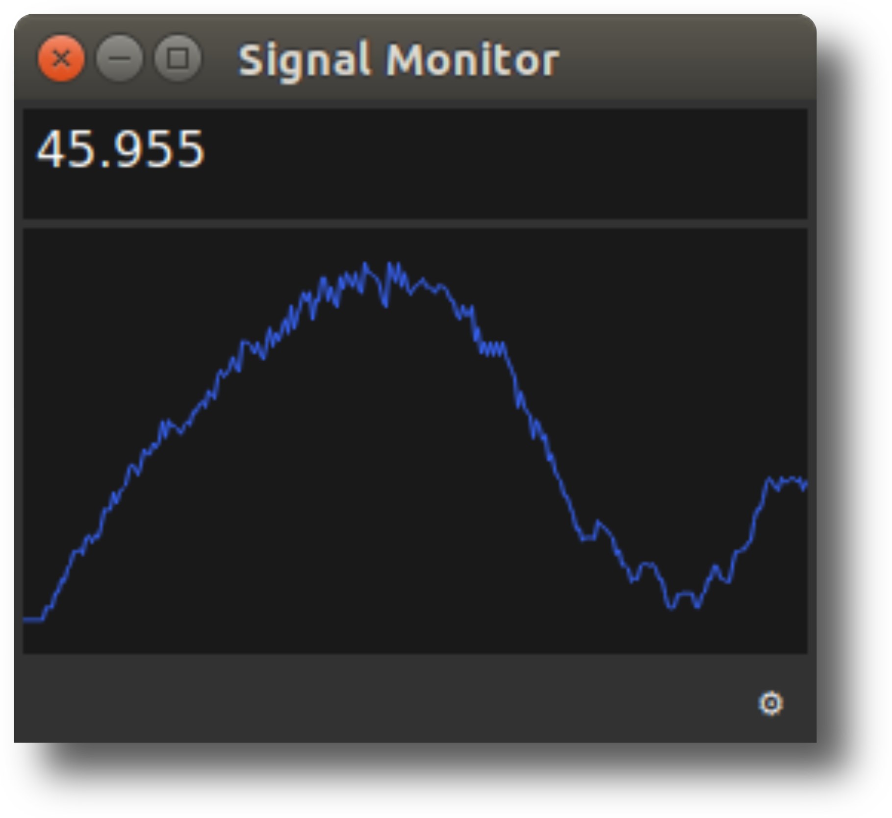

# Signal Monitor for OCTproZ
Signal Monitor is a plugin for [OCTproZ](https://github.com/spectralcode/OCTproZ).  

  

Signal Monitor displays an image metric value calculated over a selectable region of interest (ROI). The image metric can be the sum, average, standard deviation, or the coefficient of variation of all pixel values within the ROI.

The image source can be either live processed B-scan images or or the raw frames. To use processed B-scan images, you must enable the "Stream processed data to RAM" feature in OCTproZ.

## License
Signal Monitor is licensed licensed under GPLv3. See [LICENSE](LICENSE).
